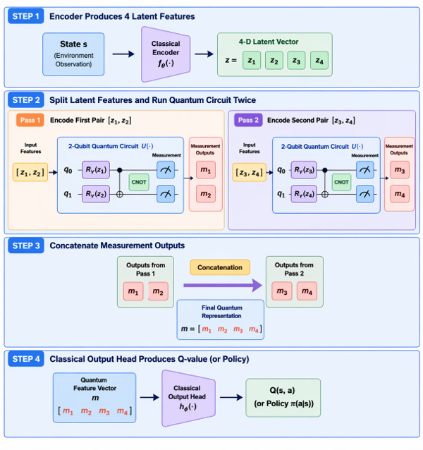
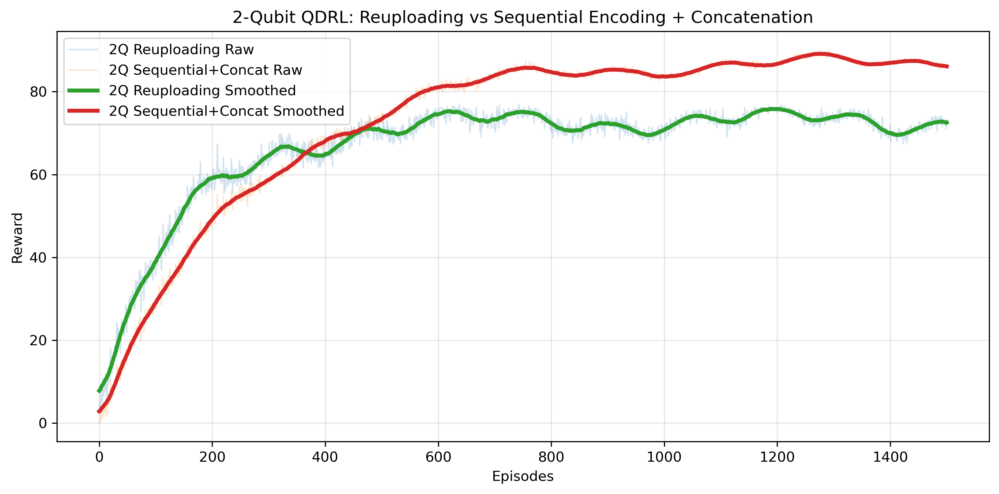

## 🔍 2-Qubit Special Analysis

Two strategies are explored:

### ✔ Re-uploading Method

- Re-encodes features multiple times
- Enhances expressivity under limited qubits
  - This is due to all the features are use for the transformation and enataglement is applied to all the features.  In this setting, we have classical encoder, which compresses the ouput to 4 latent vectors. Now, using variational quantum circircuit (VQC) of 2-Qubits, we pass the latent vectors using  data reuploading method. The out of VQC results in 2 meaurements that are pass to classical output head to map Q-values.   

---

### ✔ Sequential Encoding + Concatenation

- Processes features sequentially  
- Outputs are concatenated  
- Classical head operates on **4D aggregated features**
  -  In this setting, we have classical encoder, which comporesses the ouput to 4 latent vectors. Now, using variational quantum circircuit (VQC) of 2-Qubits, we pass the latent vectors using two forward pass in the same ietration. Then the measurements from the quantum circuit are concatenated. The concatenated features are pass to classical output head for Q-vlaues estimation. The policy learned slightly well incontrast to former approach. This is due to the classical head has richer features input. However the learning is slow to have performance gain. The performance gain comes from the interaction with more number of episodes but still the performance is beneath the 4-Qubit circuit. using
    

### ✔ Results

- Following is the convergennce plot of the 2-Qubit Quantum circuit with re-uploading method and sequential encoding + concatenation.

 
