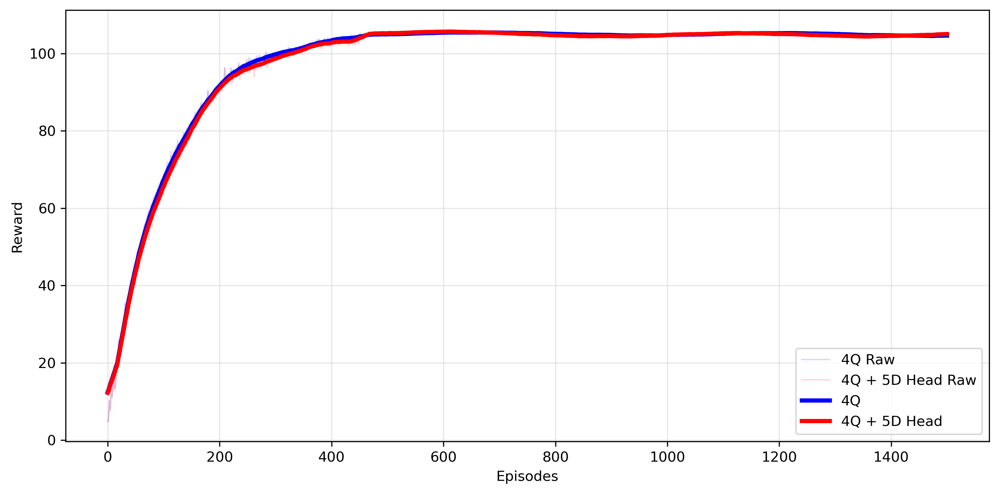

## 🔍 4-Qubit Quantum Circuit

Two settings are explored:

###  4-Qubit with Classical Output Head having 4D Input

  - In this setting, we have classical encoder, which compresses the ouput to 4 latent vectors. Now, using variational quantum circuit (VQC) of 4-Qubits, it collapse to 4 meauresments. These 4 features pass to the classical output head having 4D input features.

---

###  4-Qubit with Classical Output Head having 5D Input

 - In this setting, we have classical encoder, which compresses the output to 4 latent vectors. Now, using variational quantum circircuit (VQC) of 4-Qubits, it collapse to 4 meauresments. These 4 features pass to the classical output head having 5D input features. The 5th input of the classical output head is the average of the 4 latent features
    

###  Results

- Since the average of 4 measured latents used as a 5th input of the classical output head. From the performance it is observed that it adds little noise variance however, there is no obvious difference in performance. This might be due to no useful informative feature given to the output head.

 
