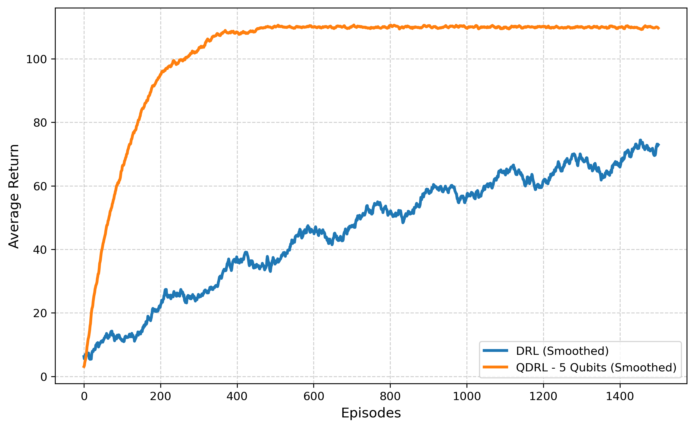

## 🔍 5-Qubit Quantum Circuit

###  5-Qubit with Classical Output Head having 5D Input

  - In this setting, we have classical encoder, which compresses the output to 4 latent vectors. The fifth feature is curated by avaeraging the 4 latent features from the encoder. Now, using variational quantum circuit (VQC) of 5-Qubits, it collapse to 5 meauresments. These 4 features pass to the classical output head having 5D input features.

---
    

###  Results

- Eventhough the 5th feature curated by averaging the 4 latent features, it shows good representation due to qunatum entaglement and superposition. However, the perfromance is slighlty better compared to 4-Qubit Quantum circuit. The performance could be further improved by choosing the features more intutively.

 
