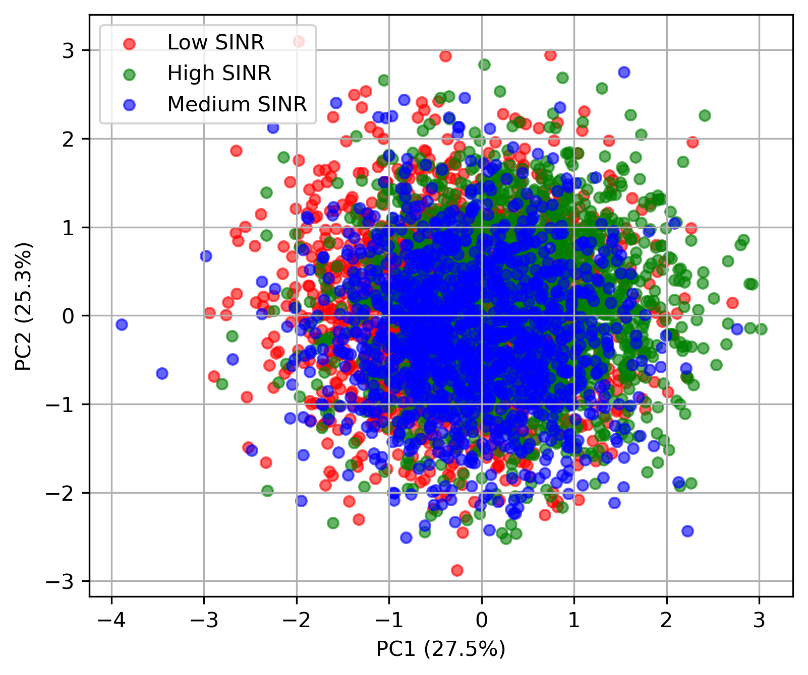

## 🔬 Representation Analysis (PCA)

### 🔍 Insights

- QDRL produces **structured and separable latent representations**  
- DRL representations are **scattered and less informative**  
- Quantum circuits improve **feature interaction via entanglement**

###

- The following shows the PCA for the MLP.

